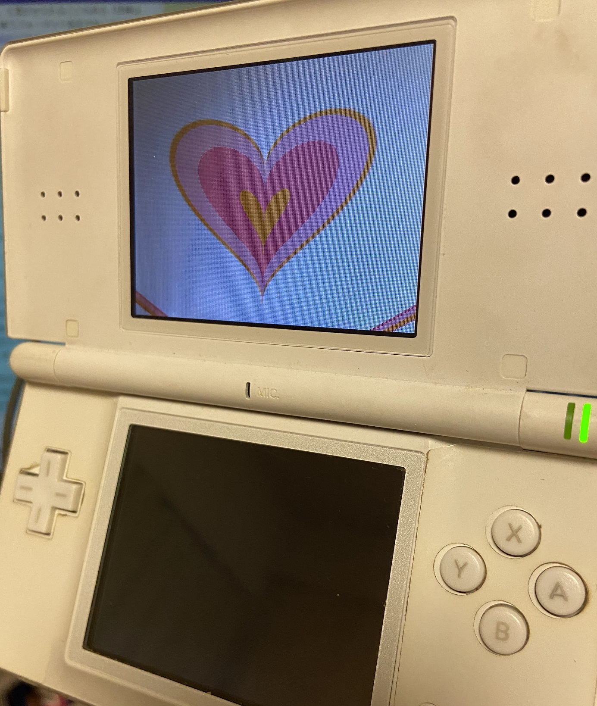

# NDSShader
 
NDSでシェーダーのようなものを動かすライブラリ 
<a href="https://github.com/NidoKota/HGShader" target="_blank" rel="noopener noreferrer">HGShader</a>のNDS移植版 (現状HGShaderより重たい) 
C++のお勉強とNDSを動かす浪漫に駆られて作った

# 注意
・相変わらず激重 
・フレームバッファはしていない なみなみ 
・CodeFreakTypeIII + NDSLiteでのみ動作確認済み 

# 操作
フレームが変わるときに判定するので、全て長押ししなければならない 
・↑ボタン : 解像度を上げる 
・↓ボタン : 解像度を下げる 
・Aボタン : 次のシェーダー 
・Bボタン : 前のシェーダー 

# コンパイル方法
DevKitProとMakeFileを導入してmakeコマンドを打ち込む 

# ライセンス
※MakefileはDevKitProにあったものを流用しただけ 
その他は、<a href="https://github.com/NidoKota/NDSShader/blob/master/LICENSE" target="_blank" rel="noopener noreferrer">MIT</a> 
